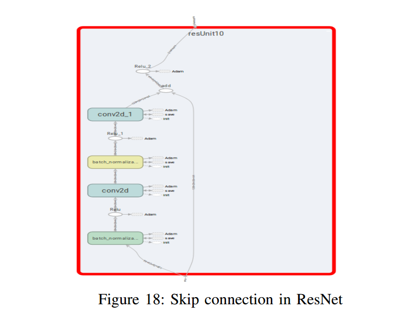

## ResNet 

1. Made up of residual blocks which contains input being summed with the ouput of two convolving layers just before applying ReLU. (See fig.)

2. Solves the problem of vanishing gradients and therefore the networks can go deeper without having the vanishing gradient problem.

3. Deeper Nets are possible without having to have the problem of vanishing gradients.

4. Why ResNets work?

This is because the ouput function to a ResNet block is a(l+2)=g(W(l+2)a(l+1)+b(l+2)+a(l)), where g(x) is the nonlinear operator. In the situation where W(l+2) and b(l+2)=0, the function a(l+2) becomes a(l). Therefore the block now becomes a good approximator of the identity function.

This means that adding a previous output does'nt really hurt the output of the function and atmost will resemble a simple net without the skip connections.

