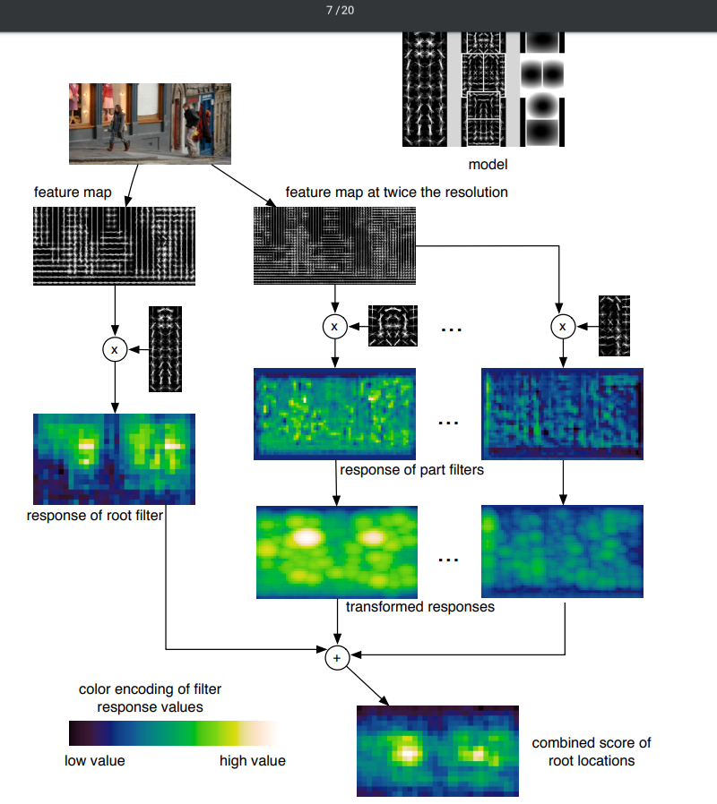

# Object Detection with Discriminatively Trained Part Based Models

Keywords for the paper: Latent SVM, hard negative mining

1. This paper is a larger extension to the HOG paper, wherein trained HOG detectors are placed over the whole object to perform a detection in a sliding window fashion.

The overview of the paper is:

