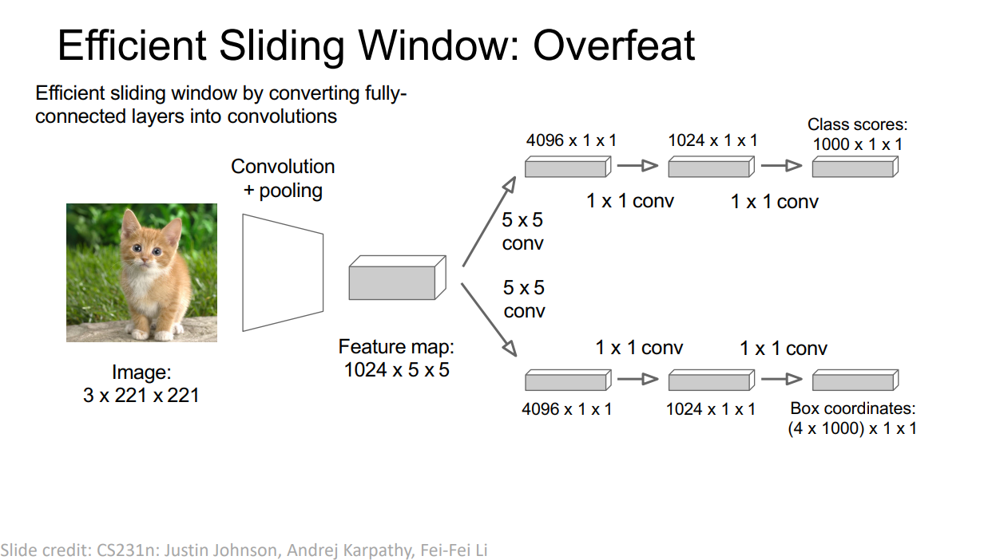
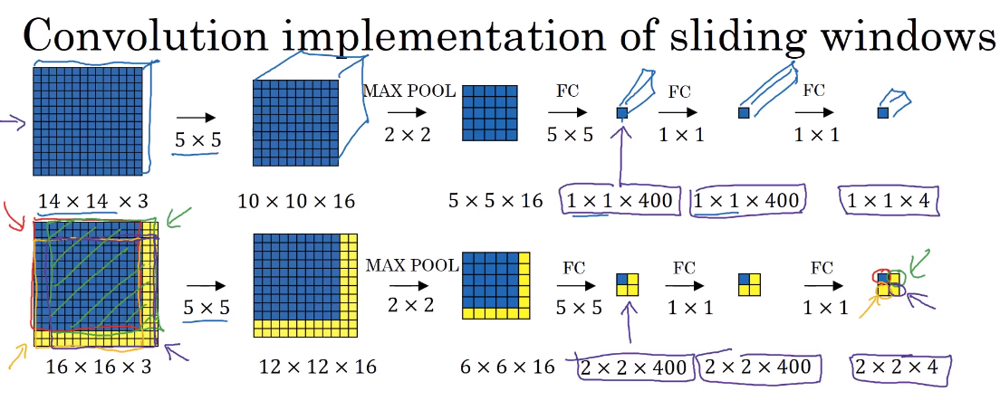

# OverFeat: Integrated Recognition, Localization and Detection using Convolutional Networks

Classification and localization refers to just one object being present in the image and localizing that one image. Detection refers to detecting multiple objects in an image and also give in their locations.

1. OverFeat is the first paper that addresses the goal of integrating classification, localization and detection.
2. This is done by parallely outputting a classification layer and bounding box regressor from the **same** feature extractor.

3. The detection works by using a ConvNet for **each** sliding window and produce a classification and regression output. But this can be computationally very expensive task.
4. The major contribution in the paper is that of **efficient sliding windows** solution to the above problem.
5. The network essentially converts every fully connected layer to a convolution layer, thereby mapping the size of every window to a single convolution cell in the final layer. The final convolution layer thus contains just a single cell mapping from every window in the original image.

6. The final layer thus contains a method to produce the best bounding box from all the sliding windows in the original image.