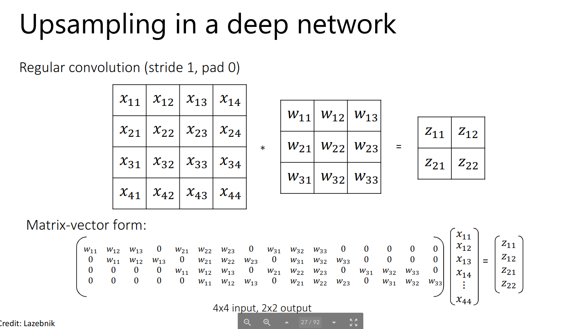
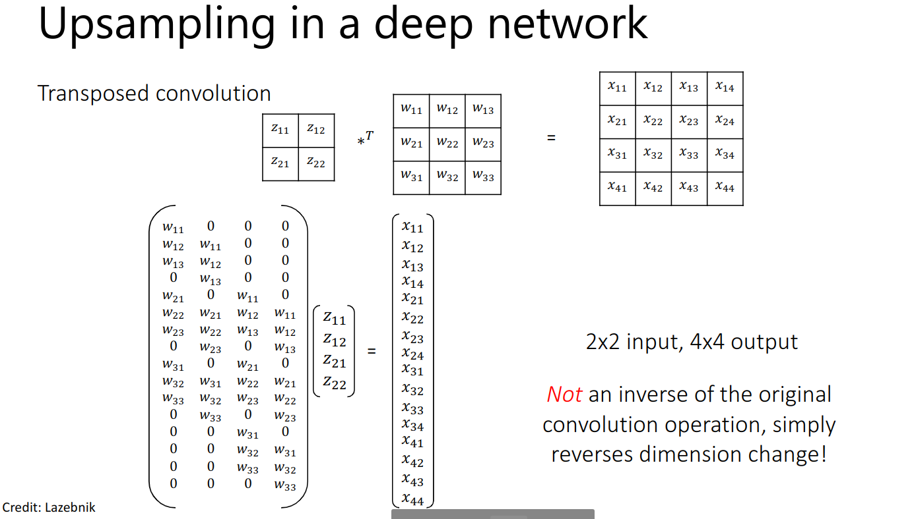

## Fully Convolutional Networks for Semantic Segmentation

See this blog [post](https://towardsdatascience.com/review-fcn-semantic-segmentation-eb8c9b50d2d1) for an overview.

Keywords to look for: upsampling, deconvolution, fractionally strided convolution , backward strided convolution, transposed convolution?

1. Why is deconvolution a bad word to use and why is it called transposed convolution?

2. How do fractionally strided convolutions work? See this for an [explanation](http://www.youtube.com/watch?v=nDPWywWRIRo&t=24m36s)

3. How is the 32x upsampling done using bilinear interpolation? See [this](https://datascience.stackexchange.com/a/46710/83753) answer for an awesome explanation.

Overview Points:

1. They do 32x upsampling from the last conv coarse layer initially.
2. This is bad, as it is an agrresive upsampling and loses information (basically a lot of smoothing effect will be there)
3. Training process: Train for 32x upsampling
4. Testing/Inference time, combine 8x, 16x, etc to get better result due to non-neglecting spatial information.
