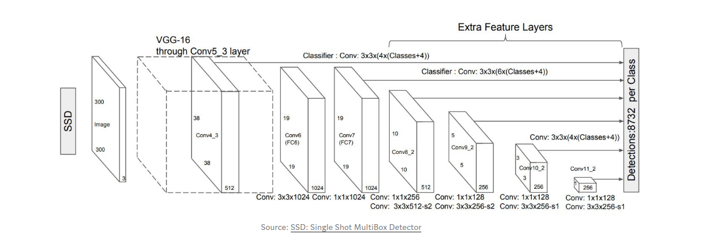
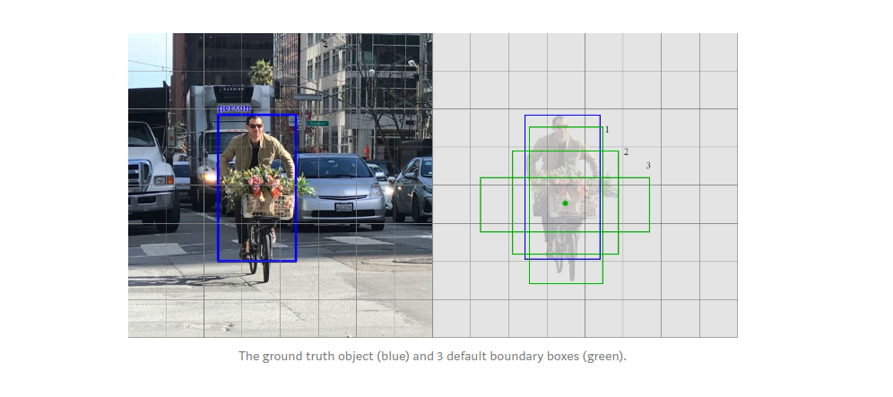

## SSD: Single Shot MultiBox Detector

This is a single shot detector (same as OverFeat) and for a expanded explanation see this [blog](https://medium.com/@jonathan_hui/ssd-object-detection-single-shot-multibox-detector-for-real-time-processing-9bd8deac0e06) post.

1. All of the detectors mostly use two underlying techniques to detections: First, to build a feature map and then apply convolution filters to detect objects at different scales. Same is used by SSD.

2. The SSD network is based of VGG16 architecture. Upto the Conv4_3 layer it is essentially a feature extractor.
3. The detections start from the Conv4_3 layer where a 38x38x512 mapped layer is present. Every cell in this 38x38 spatial layer is used to output 4 predictions. Each of these 4 predictions contains 21 class scores (20 objects and 1 background score) and 4 of the bounding box predictions.
4. Similar to this stage at a particular scale, similar predictions are made for different scales in the consecutive layers with sometimes to 6 predictions per box for smaller resolutions. This way the later reduced resolution layers are responsible to detect bigger objects. **Higher resolution feature maps are responsible for detecting small objects. The first layer for object detection conv4_3 has a spatial dimension of 38 × 38, a pretty large reduction from the input image. Hence, SSD usually performs badly for small objects comparing with other detection methods. **
5. In order to predict the bounding boxes for each cell in layer starting the conv4_3 layer, the architecture uses 4 (or 6 in later layers) default bounding boxes to cover a wide range of spectrum of objects. The regressed output of bounding boxes are not coordinates but an offset to the location of these bounding boxes.

6. For each of the bounding box, the loss is calculated only on the box that has a higher IoU than 0.5.

7. Since there is a class imbalance between the foreground and background detections, SSD picks the negatives with the top loss and makes sure the ratio between the picked negatives and positives is at most 3:1. This leads to a faster and more stable training.

8. TODO - explain the loss function and a bit more on the hard negative mining strategy.