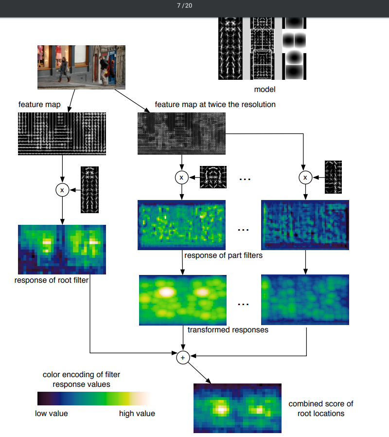
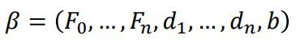
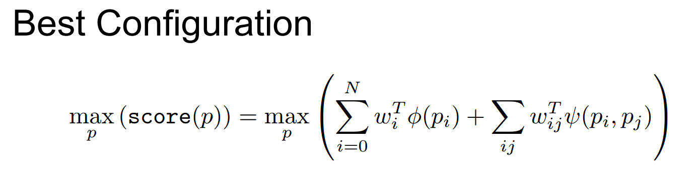

# Object Detection with Discriminatively Trained Part Based Models

Keywords for the paper: Latent SVM, hard negative mining, deformation scores

For a detailed explanation of the paper see [Prof. Mubarak Shah's slides for Latent SVM training](https://www.crcv.ucf.edu/wp-content/uploads/2019/03/Lecture-18-DPM.pdf) and [Prof. Abhinav Shrivastava's slides for pipeline understanding](https://umd.app.box.com/s/scucpkulje3heobemxap0yvziydmyu3h).

1. This paper is an extension to the HOG paper, wherein on top of the a single human HOG detector they incorporate different 'parts' (a parameter) filters as well deformation penalties.
2. Which means for a learned deformation filter (a quadratic cost function), if a part of an object is not where it is supposed to be, it will be penalised accordingly.
The pipeline of the paper is:

3. The scoring is done similar to Dalal and Triggs detector for humans. A learnt weights vector, that contains the learnt root filter, part filters, deformation filters and a bias term.

4. The training is a tricky part in the pipeline needs to learn the part filters but there are no part filter annotations! So essentially, in training the SVM for beta(which is the unknown) we have another variable to train - the **part locations** or the latent variables.
5. Since there are two unknown variables in the training, the training is done in two steps through the Latent SVM.
6. In the first part, all the part locations or the latent variable **z** is fixed for all the training images and then a linear SVM is trained in order to get the filter weights or beta.
7. Next, all the **positive** examples from the previous training set are taken and now beta is fixed and trained on getting the latent variable z. This is iteratively optimized.
8. The method also contains on training with a mixture of these models. See [slides](https://www.crcv.ucf.edu/wp-content/uploads/2019/03/Lecture-18-DPM.pdf) for more explanation. **TODO**
9. The paper also explains a nice trick to handle really large number of negative examples with respect to the positive examples.